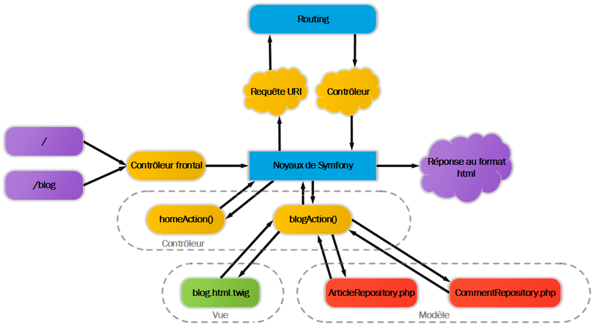

# Installation de symfony

Pour installer Symfony nous pouvons utiliser composer et lui demander d'installer les packages dont nous avons besoin.

Depuis les dernières version de Symfony, il est recommandé d'utiliser directement l'executable de Symfony pour l'installation.

Lors de l'installation de Symfony nous allons pouvoir préciser quels composants seront nécessaire à notre projet en utilisant différente `recettes` d'installation ou différent `squelletes`. 
Par exemple installer une version `lite` du Framework pour une utilisation simple (pas de rendu HTML spécifique).
Ou installer une version complète qui contient les composants nécessaire pour une utilisation de Symfony dans le cadre d'un projet Web. 
C'est cette dernière option que nous allons utiliser maintenant.

## Prérequis 

Avant toute chose vous devez vous assurez que vous disposez des bons prérequis :

> https://symfony.com/doc/current/setup.html#technical-requirements

- PHP 7.2.5 ou > . Et les extensions PHP suivante normalement déjà installées par défaut :  Ctype, iconv, JSON, PCRE, Session, SimpleXML, and Tokenizer;
- Composer dans sa dernière version
- Symfony CLI pour installer Symfony et utiliser le server Web et les fonctionnalités avancées : https://symfony.com/download


Pour valider que tout est bon une fois l'installation de la CLI Symfony, ouvrez un terminal et tapez la ligne de commande : 

```bash
symfony check:requirements
```

Mettre à jour composer :

```bash
composer self-update
```

## Première installation

Pour installer le webSite Skeleton (les composants Symfony de base pour faire un site Web) executez cette ligne de commande. Le téléchargements des packets commence et peut-être un peu long !

> Placez vous dans le dossier parent où vous voulez créer votre projet.
> Inutil d'être dans votre dossier Web (de WAMP, MAMP ou Laragon). Nous n'avons pas besoin de notre serveur Web. Symfony fourni un serveur Web embarqué. A vous de bien ranger votre projet. Privilégiez votre dossier Web tout de même pour retrouver facilement votre projet !

> Remplacez **myDirectoryProjectName** par le nom de votre projet. Qui sera aussi le nom du répertoire. Par exemple Blog.

```bash
symfony new --full myDirectoryProjectName
```

Il est possible de préciser la version installé. La ligne précédente va installer la dernière version de Symfony. Si vous souhaitez installer la version prise en charge à long terme (actuellement la 4.4 LTS) :


```bash
symfony new --full myDirectoryProjectName --version=lts 
```

Il est tout à fait possible d'installer Symfony en passant directement par Composer. Mais de notre côté nous allons utiliser l'outil en ligne de commande de Symfony. Avec Composer il faudrait taper la ligne de commande :

```bash
composer create-project symfony/website-skeleton myDirectoryProjectName
```

## Premiers tests 

Déplacez vous ensuite dans votre dossier Symfony. Vous pouvez jeter un oeil à l'arborescence des fichiers, nous y reviendrons ensemble. Mais vous devez déjà y retrouver vos petits ;)

**Valider le fonctionnement**

On lance le serveur Web embarqué avec Symfony :

```bash
php bin/console server:run
```

Suivez l'url vers localhost proposée. Vous devriez voir la page de fonctionnement de Symfony !

## L'architecture de Symfony



## L'arborescence de Symfony

**bin/**        Les executables en ligne de commande PHP. La commande Console

**config/**     L'ensemble de la configuration de Symfony, des Packages, des Services...

**migrations/** Les migrations Doctrine (migration des entités vers la base)

**public/**     C'est le point d'entrée de votre application. On y trouve le FrontController qui reçoit toutes les requêtes. On y place aussi tous les `assets` de notre site (JS, img, CSS...)

**src/**        Le répertoire de vos développements. Contient les entités, les controllers, les Repository et plus généralement tous vos développement et vos classes. 

**templates/**  Le dossiers des templates HTML. Vous y déposerez vos fichiers Twig.

**tests/**      Pour les tests unitaires.

**var/**        Les fichiers temporaires comme le Cache.

**vendor/**     L'ensemble des packages et dépendances nécessaire à voptre projet et configurés et installé avec `Composer`


## Création de votrez premier Controller

Notre but est de créer une première page sur notre application. 

Pour cela nous devons créer un premier controller et une première route pour que Symfony transmette la réponse attendu.


### Création du Blog controller 

Nous allons utiliser la console de Symfony et ses fonctionnalités **make** pour nous assister dans la création d'un Controller

```bash
    php bin/console make:controller BlogController

    # Vous pouvez aussi utiliser l'executable Symfony
    # symfony console make:controller BlogController
```

Symfony va vous créer 2 fichiers :

**Le controller dans `src/Controller/BlogController.php`**

```php
namespace App\Controller;

use Symfony\Bundle\FrameworkBundle\Controller\AbstractController;
use Symfony\Component\HttpFoundation\Response;
use Symfony\Component\Routing\Annotation\Route;

class BlogController extends AbstractController
{
    /**
     * @Route("/blog", name="blog_index")
     */
    public function index(): Response
    {
        
        return $this->render('blog/index.html.twig', [
            'controller_name' => 'BlogController',
        ]);
    }
}

```

**Une vue pour la méthode index du controller dans `templates/blog/index.html.twig`**

```html


Hello BlogController!


    (...)

```

**Accèder à l'action index de notre controller Blog**

Dans l'URL d'accès à votre site réjouter la route définie dans l'annotation (le commantaire spécifique) au dessus du nom de la méthode.

Ici Symfony est configuré pour gérer les toute par annotations.

Chaque Controller et chaque méthode de celui -ci doit donc définir les routes d'accès par rapport à l'URL de base.

IL nous suffit d'accèder à notre site via l'url :

> **http://127.0.0.1:8000/blog** (configurer l'url selon l'url fournie par le serveur Symfony)

Nous voulons maintenant que notre méthode index réponde à l'URL principal.
En gros qu'elle devienne la page d'accueil de notre site. IL nous suffit de modifier l'annotation :

```php

    /**
     * @Route("/", name="home")
     */
```

Le nom donné à la route (name=) nous permettra de générer des liens vers cette route.
Il doit donc être compréhensible et unique !


## Exercices 

### Exercice 1 : première page et rendu des vues

Générez dans la méthode index un tableau contenant 10 articles à l'aide Faker.
Affichez ce tableau dans le vue.

Symfony possède sa propre fonction `dump` pour déboguer vos variables. L'avantage c'est que le débogage apparait dans le **Profiler** de Symfony !

Ajoutez ensuite le thème utilisé pour le blog en modifiant la base HTML et en joutant vos assets dans le dossier `public`


### Exercice 2 : lien vers la page d'accueil sur le nom du blog

Ajoutez un lien vers la page d'accueil dans le bandeau de navigation sur le nom et le lien Home.
Regardez du côté de l'instruction `path` utilisable dans vos vues Twig.

### Exercice 3 : créer une page à propos

Créez une page à propos. Il va nous falloir créer une nouvelle route *about*.
Dans le menu nous allons devons mettre une classe active sur le menu en cours !
Comment faire ?

Faire la même chose pour une page contact !
