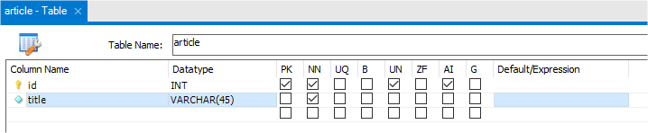

# Conception des données

Nous allons concevoir notre schéma de données pour créer plus facilement nos entités et nos relations sous Symfony.

ATTENTION : notre MCD doit donc appliquer une nomenclature PHP et non SQL pour le nommage des tables et des champs.

**Exemple :**
Table `article` avec le champ `id`, `title`

**En SQL on aurait utilisé par exemple :**
Table `blog_article` avec le champ `art_id`, `art_title`

## Etape 1 : modélisation de la base de données

Nous allons modéliser la base de données sous MysqlWorkBench avec les informations suivantes sur les tables.
Pour la modélisation il faut installer MysqlWorkBench. 
Puis dans le menu `File > New Model` ou `Fichier > Nouveau Model`
Ensuite vous devez renomer votre base de données de MyDb vers Blog puis créer un diagramme :


Dans le diagramme vous devez ajouter une première table, puis la renommer (par exemple **article**) :


Il faut ensuite ajouter nos noms de colonnes et leur propriétés :



>
> Ajouter tous les champs (colonnes) à la table **article** puis faîtes toutes vos tables. 
>
> Reportez vous pour ça aux définitions de nos table ci-après.
>
> Nous passerons ensuite aux relations et à la cardinalité des ces relations entre nos table !
>

** A savoir : **

> **PK** : primaryKey
>
> **NN** : not null
>
> **UQ** : unique key (pour l'email de l'utilisateur par exemple, pas de doublon dans la base)
>
> **B**  : binarie : données binaire (Inutile pour nous !)
>
> **UN** : unsigned : des chiffres positifs seulement 
>
> **ZF** : zero forced : si numéric  rajoute des 0 devant le nombre pour stocker un nombre de caractère donné. Exemple si INT(11) et 50000 dedans, Mysql stockera en réalité 00000050000 dans la table)
>
> **AI** : auto increment : pour les clefs primaires, obligatoire pour nous
>
> **G** : générated column : colonne générée à partir d'autres colonnes (inutile pour nous)

Vous pouvez sélectionner le type de colonne (INT, VARCHAR, TEXT, DATETIME) et donnez des paramètre (INT(11) un entier sur 4 octets avec 11 chiffres maximum, ou VARCHAR(255) une chaine de 255 caractères maximum)

Pour comprendre la différences entre BYTES, bit, Octet :

[Infos BYTES, bit, octet](https://www.science.lu/fr/les-unites-informatiques/quest-ce-que-les-bit-byte-octet)

Pour comprendre les types de champs possible dans MySql et leur taille :

[Tuto SQL TYPE](https://openclassrooms.com/fr/courses/1959476-administrez-vos-bases-de-donnees-avec-mysql/1960456-distinguez-les-differents-types-de-donnees)


### Table article
    - id (PrimaryKey)
    - title 
    - content 
    - picture
    - slug 
    - createdAt 
    - publishedAt 
    - valid

### Table category

à définir ensemble

### Table comment

à définir ensemble

### Table user

à définir ensemble

## Nous devons maintenant ajouter les relations

Pour le moment dans les colonnes proposées ci-dessus nous n'avons pas les clefs étrangères. 

Le fait de faire ces relations va créer ces clefs automatiquement.

Par exemple dans la table `article` nous auront 2 colonnes de plus pour la clef étrangère de la catégorie et celle de l'utilisateur (auteur de l'article). 

**Les relations sont les suivantes :** 

A l'aide de ces données vous devez déterminer vos relations

> 1 utilisateur peut créer articles
>
> 1 catégorie peut contenir plusieurs articles
>
> 1 article peut avoir plusieurs commentaires
>
> 1 catégorie peut appartenir à une autre catégorie

**Pour créer nos relations**


On sélectionne dans le menu la relation souhaitée (on utilise uniquement les relations non identifiées représentées avec des pointilés).

Cliquez ensuite sur le table de droite (n) puis sur la table de gauche (1) pour une cardinalité de 1 à n !

**C'est parti notre MCD modélisée, nous allons pouvoir passer à nos entités Symfony**

### Shéma relationnel MCD obtenu 


## Etape 2 : création des entités et des relations sous Symfony

**ATTENTION** 
> pour le moment on ne va pas créer l'entité `User` !

Nous allons créer nos entité Article, Category et Comment.
Pour le moment pas de relation nous éditerons nos entités ensuite pour rajouter les relations.
Il n'est pas nécessaire de créer la propriété **id** de nos entité, Symfony s'en occupe ! 

**ATTENTION**
> Il ne faut pas créer les propriétés de clefs étrangères elles seront créées lors de la création des relations !

> https://symfony.com/doc/current/doctrine.html
> https://symfony.com/doc/current/doctrine.html#creating-an-entity-class

### Les lignes de commandes utiles pour les entités

```bash
# creer une entité
php bin/console make:entity

# éditer une entité pour ajouter des propriétés. Ici l'entité Article
php bin/console make:entity Article

# Créer une migration (quand on a terminé les entités et leurs relations)
php bin/console make:migration

# Attention ne pas créer plusieurs migration avant de migrer ;) ça évite les problèmes !
# Si vous avez fait des erreurs après migration, modifiez vos entités, créez la migration et migrez 

# Executé la migration pour créer nos table dans la base de données
php bin/console doctrine:migrations:migrate
```

En savoir plus, tout est ici en Français et très bien expliqué : 

> https://symfony.com/doc/current/the-fast-track/fr/8-doctrine.html

### Créer des relation entre nos entités

Dans la cadre d'une relation ManyToOne, par facilité et par convenance on va éditer l'entité qui sera composé d'une autre entité et pas l'entité qui sera composé d'une collection d'entités.

Par exemple l'entité **article** qui sera composé d'une **category**

On y rajoute une propriété **category** qui sera de type relation.
On valide ensuite l'ajout d'une propriété **articles** dans l'entité **category**. 

L'entité **category** sera composé d'une collection d'**articles** !

Il nous faut choisir aussi si un article doit avoir obligatoirement une catégorie ou pas (null ou non null).

Si l'on met non null, Symfony va nous proposé de faire un choix sur la suppression en cascade des orphelins.
Dans l'idée si on supprime une catégorie, supprime t'on les articles liés à cette catégorie et qui deviennet de fait orphelins. 
Soyez prudent avec ça, on valide rarement la suppression des orphelins sauf si l'on a rédiger un cahier des charges qui le précise.
En règle général on préfère interdire la suppresion d'une catégorie si elle contient des articles. Et ça, ça se passe dans notre applications, pas dans les relations de nos entités !


### Doctrine : le modèle de notre application. Entity, Repository et Manager

Vous l'aurez compris dans Symfony, basé sur le pattern MVC, les modèles sont gérés par "Doctrine".

Plus encore, la structure de nos données est dîte **file first**. Dans la plupart des cas nous créons des entités qui vont définir comment sera structuré la base de données. 
Le principe est simple : une entiés définie une ligne d'une table de données. Un Article par exemple !
Donc c'est Doctrine à partir de nos entités qui va générer nos tables dans notre base de données.

Enfin Doctrine nous fournis un Repository par entité et un Manager pour toutes nos entités.

Le **Repository** va permettre de récupérer une ou des données dans la base. Il est aussi paramétrable par nos soins, nous pourrons donc rajouter des méthodes pour récupérer des données selon nos besoins !

Le **Manager** lui va permettre d'enregistrer nos entités dans la base de données. Soit les ajouter si elles n'existent pas, soient les mettre à jour si elles existent déjà. 

**Et si l'on a déjà une base**

> Le chemin inverse est possible, créer des entités à partir d'une base existante. Si vous avez déjà une base de données vous pouvez demander à Doctrine de créer vos entités à partir de cette base de données. Ceci est le cas si un client vous fourni sa base par exemple. Mais cela peut-être plus complexe à mettre en oeuvre correctement !

> https://symfony.com/doc/current/doctrine/reverse_engineering.html


### Hydrater notre base de donnée : les fixtures.

> https://symfony.com/doc/current/bundles/DoctrineFixturesBundle/index.html

```bash
# installer le package
composer require --dev orm-fixtures

# Executer les fixtures (faut faire la fixture avant.. voir ci-après)
php bin/console Doctrine:fixtures:load
```

Vous pouvez ensuite ouvrir le fichier `src/fixtures/AppFixtures.php`

La méthode Load sera executé quand on appelle l'exécution des fixtures en ligne de commandes. 

On va y mettre le code qui va générer du contenu dans notre base de données... en utilisant le **Manager** qui est injecté (injection de dépendance) dans la méthode `load()`

** Exemple à adapter à vos besoins (non de vos propriétés...), et rajoutez 10 commentaires par Article ;)

```php
public function load(ObjectManager $manager)
{
    $faker = Factory::create('fr_FR');
    
    for ($j=0;$j<10;$j++) {
        $category = new Category();
        $category->setTitle($faker->sentence())
            ->setDescription($faker->realText(300))
            ->setPicture('https://picsum.photos/300/200?id='.uniqid());

        $manager->persist($category);

        for ($i=0;$i<10;$i++) {
            $article = new Article();
            $article->setTitle($faker->sentence())
            ->setContent($faker->realText(600))
            ->setCreatedAt(new \DateTime($faker->date('Y-m-d H:i')))
            ->setPublishedAt(new \DateTime($faker->date('Y-m-d H:i')))
            ->setPicture('https://picsum.photos/300/200?id='.uniqid())
            ->setCategory($category)
            ->setValid(true);

            $manager->persist($article);
        }
    }
    $manager->flush();
}
```


## Etape 3 : affichage de tous nos articles sur la page d'accueil

Jusqu'à présent nous affichions des articles générés directement dans notre méthode `index` de notre `BlogController`

Nous allons maintenant utiliser à la place les articles générés avec les fixtures, donc en base de données.

Le but va être de récupérer tous les articles présent dans la base.

Pour cela nous allons avoir besoin de notre **repository Article** dans notre méthode `index`.

Symfony est capable de nous fournir le Repository à travers les services et l'injection de dependances.

Tout est déjà configuré pour nous dans Symfony. Il nous suffit de lui demander de nous fournir ce repository en paramètre de notre méthode `index` :

```php

use App\Repository\ArticleRepository;

//....

    /**
     * @Route("/", name="home")
     */
    public function index(ArticleRepository $articleRepository): Response


```

Dès lors nous pouvons utiliser ce Repository et ses méthodes héritées pour aller chercher nos données.

Voici les méthodes possibles décrites dans la classe **ArticleRepository**

```php
/**
 * @method Article|null find($id, $lockMode = null, $lockVersion = null)
 * @method Article|null findOneBy(array $criteria, array $orderBy = null)
 * @method Article[]    findAll()
 * @method Article[]    findBy(array $criteria, array $orderBy = null, $limit = null, $offset = null)
 */
 ```

La classe possède aussi une méthode magique (__call) qui permet d'intercepter des appels de méthodes spécifiques et d'en déduire vos besoins. Principalement pour une sélection unique par critères

**Par exemple  :**
```php
// A article par son titre avec la méthode existantre **findOneBy**
$article = $articleRepository->findOneBy(array('title' => 'Super titre'));

// A article par son titre avec la méthode magic (__call magic)
$article = $articleRepository->findOneByTitle('Super titre');

//Ces deux appels produisent la même chose */
```

### Récupérer nos articles et les passer à la vue Twig

Nous allons donc récupérer tous nos articles à l'aide du **ArticleRepository**

Nous allons obtenir une collection d'ojet **Article**. Une tableau qui contient tous les articles sous la forme d'un objet de type entité **Article**.

Il nous reste "juste" à passer cette collection à notre vue qui s'occupera de boucler dessus et d'afficher les valeurs.

**Dans notre Controller :**

```php
/**
 * @Route("/", name="home")
*/
public function index(ArticleRepository $articleRepository): Response
{
    // Récupération des articles valid triés par date de publication décroissante
    $articles = $articleRepository->findBy(['valid'=>true], ['publishedAt'=>'DESC' ]);

    // Récupération de la Reponse fournie par la vue Twig. On lui passe les articles
    return $this->render('blog/index.html.twig', [
        'articles' => $articles
    ]);
}
```

**Dans notre Vue :**

```twig

    <div class="post-preview">
        
        <a href="post.html">
            <h2 class="post-title">
                {{ article.title }}
            </h2>
            <h3 class="post-subtitle">
                {{ article.content }}
            </h3>
        </a>
        <p class="post-meta">Posté par
            <a href="#"></a>
            le {{ article.publishedAt | date("d-m-Y H:i")}} dans la catégory {{ article.category.title }}
        </p>
    </div>
    <hr>

```

