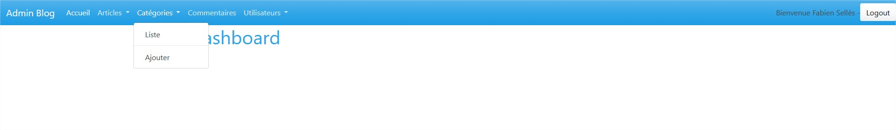

# Le BackOffice

Nous allons maintenant développer la partie permettant à l'administrateur et/ou auteur d'ajouter des articles, des catégories, des auteurs, de désactiver des commentaires.

Nous allons mettre en oeuvre un ensemble de fonctionnalités dissociées du Front de notre Blog.

Nous devons donc regrouper ces fonctionnalités dans un nouveau Controller. Le controller Admin.

La première fonctionnalités que nous allons développer concerne les catégories.

- Créer un controller Admin

- Faire en sorte que toutes les routes qui commencent par **admin** emmène à ce controller

- Utiliser la méthode `index` de ce controller pour afficher le **Dashboard** de l'admin (page d'accueil) qui sera vide pour le moment

- L'administration doit avoir un thème spécifique. Nous n'utilisaerons donc pas le même Layout que le Front. Les vues de notre admin n'hériterons donc pas du même Layout.



- Nous allons créer une nouvelle méthode pour ajouter une catégorie, puis générer un formulaire et gérer ce formulaire dans cette méthode. Pour le moment nous ne gérons pas le champs **picture**, cette valeur sera donc `null`. Nous ferons l'upload d'image plus tard.

- Nous allons créer une nouvelle méthode pour lister les catégories

- Nous allons créer une nouvelle méthode pour supprimer une catégorie et faire un lien vers cette route dans la liste des catégories

- Nous allons faire la même chose pour l'édition d'une catégorie.


**Nous allons pouvoir passer à l'ajout d'un article** et faire les mêmes fonctionnalités avec choix de la catégorie (nous laissons l'image à `null` pour le moment !)

## Bonus : l'upload d'image 

Commencez cette approche avec l'image de la catégorie.

Le plus approprié et d'utiliser le Package  **VichUploaderBundle** (à installer)

Je vous laisse voir la documentation : https://github.com/dustin10/VichUploaderBundle

Il va être nécessaire de modifier un peu notre entité `Catégorie`

**ça marche ?** : vous pouvez faire la même chose avec l'article !

### Alternative à VichUploaderBundle :

Il est aussi possible d'uploader une image sans ce Package : 

- https://symfony.com/doc/current/controller/upload_file.html

**Et même de créer un service d'Upload**

Nous parlerons des services la prochaine semaine mais il est aussi possible de développer notre propre fonctionnalité pour Uploader des images quelque soit l'entité. 

## Validation des données à l'insertion : annotations asserts

https://symfony.com/doc/current/validation.html

### AutoMapping

Mapper automatiquement la validation de nos propriétés avec la définition dans l'entité (annotations @ORM et setters) :

https://symfonycasts.com/screencast/symfony5-upgrade/auto-mapping

### Validation dans la classe Form (Type)

Il est aussi possible de valider nos données dans la classe Form. Cela est utile quand une validation ne doit-être opérée que dans le cadre de l'utilisation d'un formulaire et non pour l'entité entière :

https://symfony.com/doc/current/validation.html#constraints-in-form-classes

## Création de formulaire : choix des types de champs

Nous pouvons modifier la façon dont nos champs s'affichent dans le formulaire en précisant le type.
Cela peut-être utile pour la gestion des dates, des relations entre entités, des champs d'upload ...

https://symfony.com/doc/current/reference/forms/types.html

## Création de formulaire : sélectionner une relation avec une autre entité (la relation entre entités). Type EntityType 

Dans notre cas, pour l'entité Article, nous avons une relation (composition dans le cadre de l'objet) avec l'entité Category.

Si nous ne précisons pas à Symfony le type de ce champ de formulaire, il ne va pas savoir quoi utiliser dans le cadre de cette relation (liste à choix, checkbox, champs texte ...).

https://symfony.com/doc/current/reference/forms/types/entity.html

Exemple pour notre champ `category` avec EntityType :

```php
        $builder
            ->add('title')
            ->add('content')
            ->add('picture')
            ->add('publishedAt')
            ->add('valid')
            ->add('category', EntityType::class, [
                // looks for choices from this entity
                'class' => Category::class,
                'choice_label' => 'title',
            ]);
```

## Générer un Slug, une date de création et de mofication automatiquement

On peut utiliser les extensions de Doctrine pour générer automatiquement un Slug, ou ajouter une date de création et modifier une date de modification par exemple.

Il nous faut installer le package des extensions :

```bash
    composer require stof/doctrine-extensions-bundle
```

Quelques exemples :
- traduction (on va chercher les bonnes colonnes dans la base selon la langue/local)
- génération de slug,
- génération d'une date de création
- mise à jour d'une date de modification et d'une date à la mise à jour 
- upload
- ...

https://symfony.com/doc/current/bundles/StofDoctrineExtensionsBundle/index.html

https://symfonycasts.com/screencast/symfony-doctrine/sluggable
https://www.davidlangin.fr/articles/symfony-4-sluggable

https://symfonycasts.com/screencast/symfony4-doctrine/timestampable


